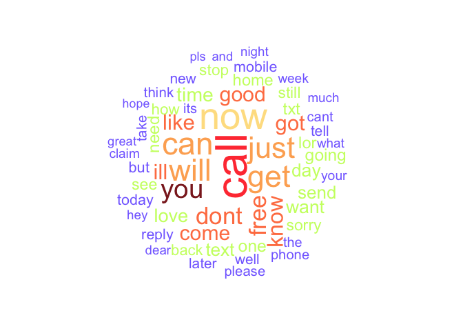
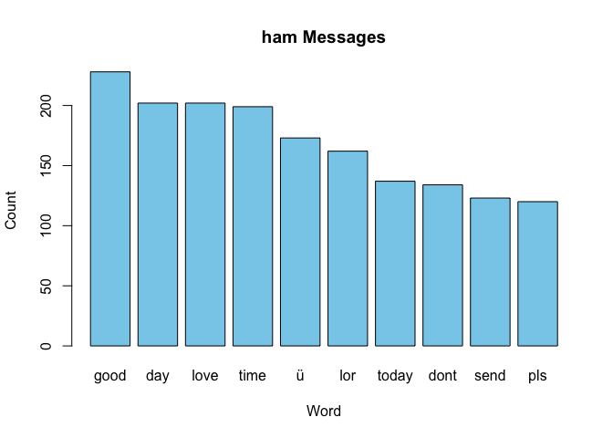
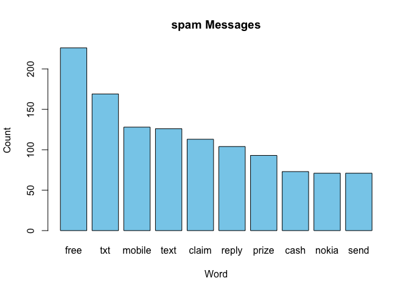

<!-- README.md is generated from README.Rmd. Please edit that file -->

# Text Analysis R Package

<!-- badges: start -->

[](https://github.com/shaveen27/text.analysis/actions/workflows/R-CMD-check.yaml)
<!-- badges: end -->

# Description

## Objective

Text analysis techniques such as Natural Language Processing (NLP) can
swiftly extract relevant information from different corpus datasets such
as documents, emails, SMS messages, social media and other textual
resources. NLP encompasses some common techniques for analyzing human
language such as tokenization, stemming and lemmatization, sentiment
analysis and text classification.

The goal of this R package “text.analysis” is to provide a series of
functions that allows a user to analyze a text dataset using some common
Natural Language Processing techniques, train some models and evaluate
their performance.

## Table of functions

The **text.analysis** package provides a series of functions for each
step of the text analysis process. These functions can be organized into
the following structure:

**1. Load Data from text files**

- `read_maildf()` reads data file that contains email messages.
- `convert_mail_list()` converts a data frame with messages to
  `email_list` object.

**2. Data Preprocessing: Standardization and cleaning**

- `lower_case()` converts all messages to lower case.  
- `remove_numbers()` removes numbers from messages.
- `remove_punctuations()` removes punctuation from messages.  
- `remove_whitespaces()` removes extra white spaces from messages.
- `remove_stopwords()` removes stop words from messages.

**3. Explore the text dataset**

- `explore_data()` performs initial exploratory data analysis on text
  data.
- `explore_visuals()` creates visualizations category distribution and
  number of words for each category.

**4. Visualizing the corpus with word clouds**

- `split_spamham()` splits the data into three subsets: corpus, spam and
  ham.
- `wordcloud_all()` provides a visualization of the frequency of words
  in our corpus.
- `wordcloud_ham()` provides a visualization of the frequency of words
  in the ham subset.
- `wordcloud_spam()` provides a visualization of the frequency of words
  in the spam subset.

**5. Data partitioning: Creating training and testing datasets**

- `final_model_df` creates the model matrix to use modelling process.
- `partition()` creates training and testing data matrices.

**6. Training a classifier on the data and evaluating model
performance:**

- `nb_classification()` computes accuracy measures for email data set
  using Naïve Bayes classification model.
- `svm_classification()` computes accuracy measures for email data set
  using Support Vector Machine classification model.
- `rf_classification()` computes accuracy measures for email data set
  using Random Forest classification model.
- `log_classification()` computes accuracy measures for email data set
  using Logistic Regression classification model.

**7. Comparing results: Evaluate the model performance and compare
them**

- Compare the accuracy of the four classifiers.

# Usage

## Programming Language

This package uses R as the main programming language and C++ for some
scripts to impove the speed of the package.

## Installation

You can install the development version of **text.analysis** as follows:

``` r
# install.package("shaveen27/text.analysis")
```

To get started on using this repository, you can also type the following
into your favorite git command line tool:

``` r
# git clone git@github.com:shaveen27/text.analysis.git
```

The previous command will download all of the code onto your computer.
You will also need to download the data in study.

## Dataset

The SMS Spam Collection is a public set of SMS labeled messages that
have been collected for mobile phone spam research.

- SMS Spam Collection:
  <https://archive.ics.uci.edu/dataset/228/sms+spam+collection>

You can also find this dataset when you install the library of this
package as follows:

``` r
library(text.analysis)
data("sms_spam_collection")
```

## How to use this package

Here is an example on how to use each function of this package:

**1. Load Data from text files**

- We use `read_maildf()` to read the data file that contains email
  messages. And we use `convert_mail_list()` to convert a data frame
  with messages to and `email_list` object.

``` r
library(text.analysis)

# Read dataset from external resources
# data <- read_maildf(file ="path/to/file")

data <- sms_spam_collection

emailList_object <- convert_mail_list(data)

head(data)
#>   category
#> 1      ham
#> 2      ham
#> 3     spam
#> 4      ham
#> 5      ham
#> 6     spam
#>                                                                                                                                                       message
#> 1                                             Go until jurong point, crazy.. Available only in bugis n great world la e buffet... Cine there got amore wat...
#> 2                                                                                                                               Ok lar... Joking wif u oni...
#> 3 Free entry in 2 a wkly comp to win FA Cup final tkts 21st May 2005. Text FA to 87121 to receive entry question(std txt rate)T&C's apply 08452810075over18's
#> 4                                                                                                           U dun say so early hor... U c already then say...
#> 5                                                                                               Nah I don't think he goes to usf, he lives around here though
#> 6         FreeMsg Hey there darling it's been 3 week's now and no word back! I'd like some fun you up for it still? Tb ok! XxX std chgs to send, £1.50 to rcv
```

**2. Data Preprocessing: Standardization and cleaning**

- We clean the text data using: `lower_case()` to convert all messages
  to lower case, `remove_numbers()` to remove numbers,
  `remove_punctuations()` to remove punctuation, `remove_whitespaces()`
  to remove extra white spaces from messages and `remove_stopwords()` to
  remove stop words from messages.

``` r
# Start cleaning
clean_corpus <- lower_case(emailList_object)

clean_corpus <- remove_numbers(clean_corpus)

clean_corpus <- remove_punctuations(clean_corpus)

clean_corpus <- remove_whitespaces(clean_corpus)

clean_corpus <- remove_stopwords(clean_corpus)

# head(clean_corpus)
```

**3. Explore the text dataset**

- We use the `explore_data()` function to perform the initial
  exploratory data analysis on the text data. The outputs for this
  function are the following: category distribution, message length
  summary, word count summary, missing data.

``` r
data_exploration <- explore_data(clean_corpus)
data_exploration[1:5]
#> $category_distribution
#> categories
#>  ham spam 
#> 4827  747 
#> 
#> $message_length_summary
#>    Min. 1st Qu.  Median    Mean 3rd Qu.    Max. 
#>    0.00   13.00   26.00   35.05   52.00  290.00 
#> 
#> $word_count_summary
#>    Min. 1st Qu.  Median    Mean 3rd Qu.    Max. 
#>   0.000   2.000   4.000   5.787   9.000  51.000 
#> 
#> $missing_data_categories
#> [1] 0
#> 
#> $missing_data_messages
#> [1] 0
```

- Then, the `explore_visuals()` function creates visualizations category
  distribution and number of words for each category.

``` r
explore_visuals(clean_corpus)
```



**4. Visualizing the corpus with word clouds**

- We run `split_spamham()` to split the text dataset into three sets:
  corpus (all corpus), ham messages, and spam messages.

``` r
corpus_data <- split_spamham(clean_corpus)

# head(corpus_data)
```

- We run `wordcloud_all()` to have a visualization of the frequency of
  words in our corpus.
- We run `wordcloud_ham()` to have a visualization of the frequency of
  words in the ham subset.
- We run `wordcloud_spam()` to have a visualization of the frequency of
  words in the spam subset.

Here is an example running the spam set:

``` r
# wordcloud_all(corpus_data$Data, min_freq = 100)
# wordcloud_ham(corpus_data$Ham, min_freq = 50)
wordcloud_spam(corpus_data$Spam, min_freq = 50)
```


**5. Data partitioning: Creating training and testing datasets**

- We use `final_model_df()` to create the model matrix to use modelling
  process. In this step, the resulting output of the function is a data
  matrix where the initial column denotes the message type, while the
  subsequent columns represent the words in the dataset.
- Then, we partition our clean data using the `partition()` function.
  This creates the training and testing data matrices.

``` r
final_model_corpus <- final_model_df(clean_corpus, tol = 2)

# partition
split_data <- partition(model_df = final_model_corpus, prob = 0.7)

# head(split_data)
```

**6. Training a classifier on the data and evaluating model
performance:**

- We explore four classifiers on the data. For all of them, we compute
  the confusion matrix and accuracy measures:

  - Naïve Bayes: `nb_classification()`
  - Logistic Regression: `log_classification()`
  - Support Vector Machine: `svm_classification()`
  - Random Forest: `rf_classification()`

``` r
# for example: Naïve Bayes classifier
nb_model <- nb_classification(split_data)

# output for Naïve Bayes: Confusion Matrix
nb_model$Confusion_Matrix
#>        
#> nb_pred  ham spam
#>    ham  1416   19
#>    spam   10  184
```

``` r
# output for Naïve Bayes: Accuracy_Measures
nb_model$Accuracy_Measures
#>   Accuracy Precision Recall F1_Score
#> 1   98.22%      0.95   0.91     0.93
```

**7. Comparing results: Evaluate the model performance and compare
them**

- After running all the classifiers, we can compare their model
  performance.

## Example of a complete Analysis Report

There is a short introduction to text analysis under the folder
**vignettes**. This shows an example on how to use this package to
create an analysis report. It uses the dataset above and explore the
four different classifier mentioned.

## Information

- The code in this repository was written by Aloka Dayarathne, Maha
  Moussa, Shaveen Britto, and Teresa White.
